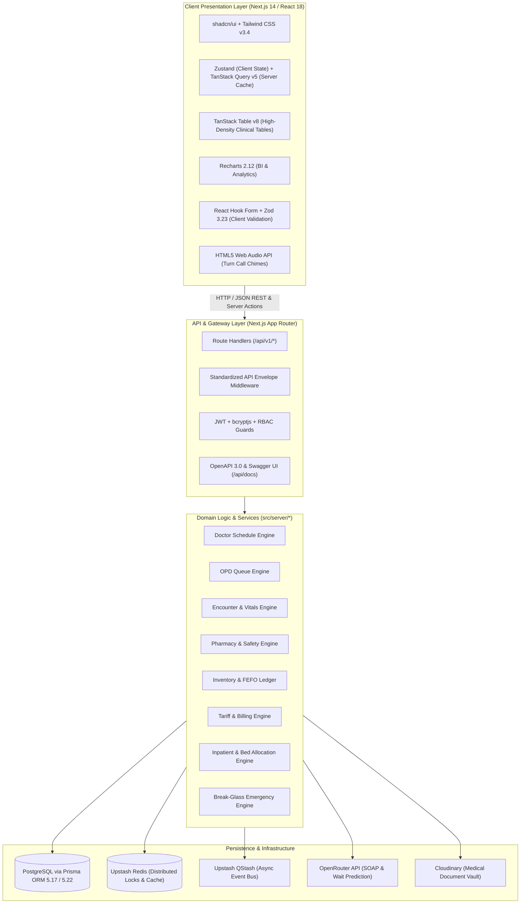
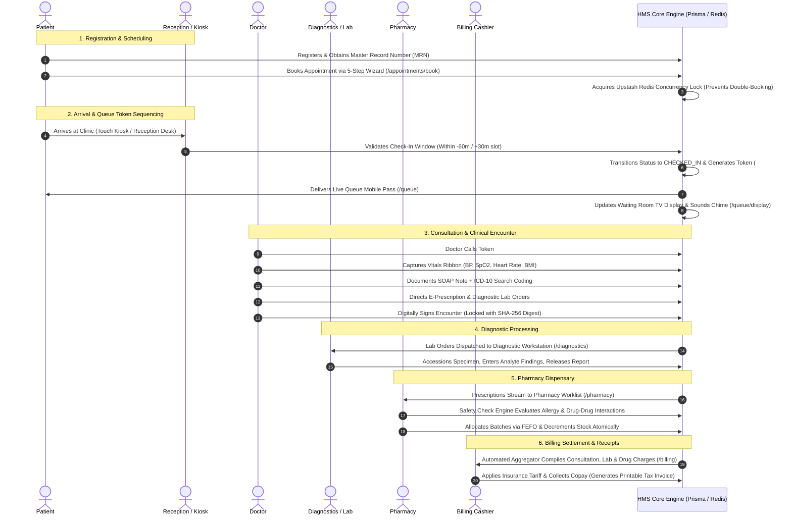

# Going Merry Hospital Management System (HMS)
## Complete Architectural Specification, Operational Lifecycles & Implementation Dossier

---

### Executive Summary

The **Going Merry Hospital Management System (HMS)** is an enterprise-grade, mission-critical healthcare operations and clinical care platform. Engineered to streamline the entire patient journey and hospital operational lifecycle, the platform strictly fulfills **78 Business Requirement Documents (BRDs)** and **310 Scope of Work (SOW) line items** across **16 core operational domains**.

The platform is designed around the **"Clinical Clarity"** aesthetic specification ([`DESIGN.md`](file:///Users/sarthakkanade/Hospital-Management-System/DESIGN.md)), optimized for high-density clinical workstations, zero layout shifts (FOUT-free font rendering), strict accessibility ratios (Teal `#00685f`, Slate `#006398`, Emerald `#10B981`), and instantaneous data retrieval across outpatient departments (OPD), inpatient wards (IPD), emergency triage, pharmacy, diagnostics, and financial desks.

---

## 1. Complete Technology Stack



### Detailed Breakdown of Technologies

| Category | Technology | Version / Tooling | Architectural Role & Implementation Details |
|---|---|---|---|
| **Core Framework** | **Next.js** | `14.2.5` (App Router) | Leverages React Server Components (RSC) for zero-bundle data fetching alongside interactive Client Components. Uses Next.js Route Handlers for high-throughput REST APIs. |
| **Language** | **TypeScript** | `5.5.3` | Enforces strict compile-time type safety across domain interfaces, Prisma schema models, API request/response contracts, and UI properties. |
| **Styling & Design System** | **Tailwind CSS + shadcn/ui** | `3.4.6` / Radix UI | Implements the "Clinical Clarity" medical workstation aesthetic. Utilizes `class-variance-authority` (`cva`), `clsx`, and `tailwind-merge` for modular, accessible component styling. |
| **State Management** | **Zustand** | `4.5.4` | Lightweight client stores managing authenticated user sessions, UI drawer toggles, active queue token state, and toast queues. |
| **Server-State & Data Caching**| **TanStack React Query**| `5.51.1` | Manages server-state synchronization, optimistic cache mutations, background data refetching, and polling synchronization across OPD queues. |
| **Data Tables** | **TanStack Table** | `8.19.3` | Headless, high-density data table engine supporting sorting, column filtering, pagination, and multi-selection for patient lists, inventory ledgers, and audit logs. |
| **Data Visualization** | **Recharts** | `2.12.7` | Executive analytics rendering daily OPD throughput curves, bed occupancy bar charts, pharmacy inventory depletion models, and billing revenue streams. |
| **Form Validation** | **React Hook Form + Zod**| `7.52.1` / `3.23.8` | High-performance isomorphic form validation. Zod schemas validate client form input and enforce payload integrity on API route handlers. |
| **Database & ORM** | **PostgreSQL + Prisma ORM**| `5.17.0` / `5.22.0` | Relational database hosted via Supabase (transaction pooler with session-based `directUrl`). Prisma manages 40+ models, relations, cascades, and ACID transactions. |
| **Distributed Locking & Caching**| **Upstash Redis** | `@upstash/redis 1.31` | Distributed mutex locking on appointment slots to prevent double-booking race conditions (`409 Conflict`), API rate limiting, and cache invalidation. |
| **Asynchronous Event Bus** | **Upstash QStash** | `@upstash/qstash 2.7`| Serverless event messaging bus handling asynchronous webhook dispatching, background jobs, delayed SMS/Email notifications, and audit logging. |
| **Clinical Intelligence** | **OpenRouter API** | Claude 3.5 / Llama 3 | Clinical decision support engine assisting with SOAP clinical note synthesis and wait-time estimation, backed by sub-500ms deterministic rule fallbacks. |
| **Object & Document Storage** | **Cloudinary** | `2.3.1` | Cloud object storage providing secure, HIPAA-compliant storage and delivery for diagnostic laboratory PDFs, imaging, ECG attachments, and scan reports. |
| **Audio Synthesis** | **Web Audio API** | HTML5 Native | Synthesizes pleasant multi-frequency turn notification chimes natively in the browser on waiting room TV screens when patients are called. |
| **Automated Testing Suite** | **Vitest + JSDOM** | `2.0.3` / RTL `16.0` | Comprehensive test runner executing 32 test suites and 126 automated unit, integration, and security checks across clinical and domain logic. |
| **API Specification** | **OpenAPI 3.0 / Swagger** | Next.js custom route | Interactive Swagger UI explorer at `/api/docs` paired with machine-readable specification schema at `/api/openapi.json`. |

---

## 2. Global Architectural Conventions & Contracts

### 2.1 Standard API Envelope Specification
All REST API endpoints (`/api/v1/*`) communicate exclusively using a standardized, predictable JSON envelope:

**Success Response Envelope (`HTTP 200 / 201`):**
```json
{
  "success": true,
  "data": { ... },
  "meta": {
    "total": 120,
    "page": 1,
    "limit": 20,
    "timestamp": "2026-09-26T08:30:00.000Z"
  }
}
```

**Error Response Envelope (`HTTP 400, 401, 403, 404, 409, 422, 500`):**
```json
{
  "success": false,
  "error": {
    "code": "QUE_ALREADY_CHECKED_IN",
    "message": "Patient has already checked in for this appointment",
    "details": { "appointmentId": "apt_12345" }
  }
}
```

### 2.2 Role-Based Access Control (RBAC)
The platform enforces granular authorization across 10 distinct hospital user roles:
1. **SUPER_ADMIN**: Full system sovereignty, emergency overrides, database policies.
2. **ADMIN**: Hospital configurations, staff provisioning, master tariff catalogs, audit logs.
3. **DOCTOR**: Clinical encounter workspace, SOAP notes, ICD-10 coding, e-prescribing, lab orders.
4. **NURSE**: Baseline vitals recording, triage assessment, inpatient medication administration (MAR).
5. **PHARMACIST**: Prescription validation, safety/allergy checks, batch FEFO allocation, dispensing.
6. **LAB_TECH**: Specimen collection, laboratory accessioning, analyte entry, report uploading.
7. **RADIOLOGIST**: Imaging study review, DICOM/scan attachment, diagnostic impression release.
8. **BILLING_STAFF**: Charge aggregation, insurance pre-authorization, invoicing, cashier checkout.
9. **INVENTORY_MANAGER**: Stock On Hand, purchase orders, goods receipt notes (GRN), lot quarantine.
10. **RECEPTIONIST**: Patient registration, walk-in scheduling, appointment check-in, token issuance.
11. **PATIENT**: Personal health portal, appointment booking, live queue pass, invoices, lab reports.

---

## 3. End-to-End Operational Flow (Step-by-Step Clinical Lifecycle)



### Detailed Step-by-Step Walkthrough

#### Step 1: Patient Identity & Master Patient Index (PAT & IAM)
- **Intake & Demographic Capture**: Patients self-register via [`/register`](file:///Users/sarthakkanade/Hospital-Management-System/src/app/register) or presenting at reception via [`/patients/register`](file:///Users/sarthakkanade/Hospital-Management-System/src/app/patients/register).
- **MRN Generation**: The system automatically issues a standardized, unique Medical Record Number (`MRN-YYYY-XXXXXX`).
- **Clinical Demographics**: Captures date of birth, blood group, emergency contacts, known allergies, chronic conditions, and insurance policy cards.

#### Step 2: Doctor Rostering & Clinic Sessions (SCH)
- **Session Templates**: Doctors and medical directors establish recurring weekly clinic rosters via [`/schedules`](file:///Users/sarthakkanade/Hospital-Management-System/src/app/schedules).
- **Conflict Engine**: [`src/server/domain/doctor-schedule.ts`](file:///Users/sarthakkanade/Hospital-Management-System/src/server/domain/doctor-schedule.ts) evaluates room availability, slot durations (e.g., 15 or 30 mins), doctor maximum capacity quotas, and scheduled blackout dates.

#### Step 3: Appointment Booking & Distributed Concurrency Locking (APT)
- **5-Step Booking Wizard**: Patients or receptionists navigate Department $\rightarrow$ Doctor $\rightarrow$ Date $\rightarrow$ Slot $\rightarrow$ Reason on [`/appointments/book`](file:///Users/sarthakkanade/Hospital-Management-System/src/app/appointments/book).
- **Distributed Mutex Lock**: The booking engine requests a Redis key lock: `lock:appointment:{doctorId}:{slotStart}`.
- **Race Condition Prevention**: If two users attempt simultaneous bookings of the same slot, Redis guarantees atomicity. The first transaction succeeds with HTTP 201; the competing transaction fails with `HTTP 409 Conflict`, completely preventing double-bookings.

#### Step 4: Patient Arrival, Self-Service Kiosks & Queue Sequencing (QUE)
- **Arrival Verification**: On appointment day, the patient checks in via the touch-optimized Self-Service Arrival Kiosk ([`/queue/kiosk`](file:///Users/sarthakkanade/Hospital-Management-System/src/app/queue/kiosk)) or reception desk.
- **Eligibility Validation**: [`src/server/domain/queue-checkin.ts`](file:///Users/sarthakkanade/Hospital-Management-System/src/server/domain/queue-checkin.ts) enforces that the appointment is `CONFIRMED` and falls within the allowable check-in window (up to 60 minutes before and 30 minutes after scheduled slot).
- **Token Sequencing**: Generates a sequential, departmental token (e.g. `#A-24`, `#E-01` for emergency priority triage).
- **Live Mobile Queue Pass**: Patient monitors their live queue position, estimated wait time, and progress bar on their mobile device via [`/queue`](file:///Users/sarthakkanade/Hospital-Management-System/src/app/queue).
- **Waiting Room TV Board**: Fullscreen display ([`/queue/display`](file:///Users/sarthakkanade/Hospital-Management-System/src/app/queue/display)) updates dynamically, synthesizing multi-tone turn chimes via the Web Audio API when a patient's token is called.

#### Step 5: Clinical Encounter Workspace & Doctor Consultation Desk (EMR)
- **Consultation Console**: Doctor opens [`/doctor`](file:///Users/sarthakkanade/Hospital-Management-System/src/app/doctor), viewing the real-time queue worklist.
- **Status Lifecycle**: Calling the patient transitions token status to `CALLED`, ringing the waiting room chime. Entering the room transitions status to `IN_CONSULTATION`.
- **Baseline Vitals Ribbon**: Nurse or doctor records Blood Pressure (Systolic/Diastolic), Heart Rate, SpO2, Body Temperature, Weight, and Height. The system automatically computes BMI and flags abnormal biometric readings.
- **Clinical SOAP Editor**:
  - **S (Subjective)**: Chief complaints and history of present illness.
  - **O (Objective)**: Physical examinations, clinical observations, vitals summary.
  - **A (Assessment)**: Searchable ICD-10 diagnostic coding (e.g., `J06.9` Acute URI, `E11.9` Type 2 Diabetes).
  - **P (Plan)**: E-prescriptions, lab test orders, nursing instructions, follow-up timelines.
- **Clinical AI Assistant**: Integrated OpenRouter AI assists with differential diagnosis summaries and patient-friendly instructions with deterministic fallbacks.
- **Digital Sign-Off**: Clinician completes encounter sign-off, locking the medical record to `FINALIZED`. An immutable SHA-256 digital certificate hash is generated, preventing post-signature tampering.

#### Step 6: Laboratory & Diagnostic Workstation (DIA)
- **Order Dispatch**: Encounter lab orders immediately route to the Diagnostics Desk ([`/diagnostics`](file:///Users/sarthakkanade/Hospital-Management-System/src/app/diagnostics)).
- **Specimen Tracking**: Phlebotomist/technician marks sample as `COLLECTED` with barcoded accessioning.
- **Analyte Result Entry**: Technicians enter numerical/text findings and reference ranges ([`/diagnostics/orders/[id]`](file:///Users/sarthakkanade/Hospital-Management-System/src/app/diagnostics/orders/[id])).
- **Validation & Release**: Pathologist electronically signs off, instantly publishing findings to the patient's EHR and generating an official printable PDF report ([`/reports`](file:///Users/sarthakkanade/Hospital-Management-System/src/app/reports)).

#### Step 7: Pharmacy Dispensary, Safety Engine & Batch FEFO Allocation (PHA & INV)
- **Dispensary Worklist**: Finalized prescriptions stream directly to the Pharmacy Console ([`/pharmacy`](file:///Users/sarthakkanade/Hospital-Management-System/src/app/pharmacy)).
- **Automated Clinical Safety Engine**: Validates prescribed medications against:
  1. Patient allergy records (e.g. Penicillin, Sulfa drugs).
  2. Severe Drug-Drug Interactions (DDI) (e.g. Warfarin + Aspirin hemorrhage risk). Overrides require mandatory clinical rationale logging.
- **FEFO Batch Allocation**: In accordance with First-Expired, First-Out (FEFO), the system allocates specific medicine lots nearing expiration first ([`/inventory/batches`](file:///Users/sarthakkanade/Hospital-Management-System/src/app/inventory/batches)).
- **Atomic Stock Decrement**: Dispensing atomically deducts stock-on-hand quantities and creates an immutable, append-only transaction in the stock movement ledger.

#### Step 8: Inpatient Ward Admission, Bed Grid & Care Coordination (IPD)
- **Admission Request**: Clinician initiates hospitalization request for acute cases.
- **Interactive Color-Coded Bed Grid**: Real-time bed occupancy visualization across CCU, ICU, and General Wards ([`/inpatient`](file:///Users/sarthakkanade/Hospital-Management-System/src/app/inpatient)).
- **Inpatient Care Management**: Implemented in [`src/server/domain/inpatient-care.ts`](file:///Users/sarthakkanade/Hospital-Management-System/src/server/domain/inpatient-care.ts), manages daily nursing progress notes, Medication Administration Records (MAR), bed transfers, and multi-factor discharge clearance.

#### Step 9: Billing, Tariffs, Insurance Claims & Payment Settlement (BIL)
- **Automated Charge Aggregation**: Consultations, lab tests, medications, procedures, and inpatient bed-days automatically roll into the patient's billing account ([`/billing`](file:///Users/sarthakkanade/Hospital-Management-System/src/app/billing)).
- **Tariff & Insurance Engine**: [`src/server/domain/charge-catalog.ts`](file:///Users/sarthakkanade/Hospital-Management-System/src/server/domain/charge-catalog.ts) and [`src/server/domain/invoice-pricing.ts`](file:///Users/sarthakkanade/Hospital-Management-System/src/server/domain/invoice-pricing.ts) compute hospital tariffs, apply insurance co-pays, and calculate net payable balances.
- **Checkout & Settlement**: Multi-mode cashier settlement (Cash, Card, TPA Insurance, Online Checkout) producing itemized tax invoices and receipts ([`/billing/invoices/[id]`](file:///Users/sarthakkanade/Hospital-Management-System/src/app/billing/invoices/[id])).
- **Refunds & Reversals**: [`src/server/domain/refund-reversal.ts`](file:///Users/sarthakkanade/Hospital-Management-System/src/server/domain/refund-reversal.ts) handles payment reversal validation, manager approvals, and financial ledger reconciliations.

#### Step 10: Administration, Immutable Audit Trails & Emergency Break-Glass (ADM & SEC)
- **Staff User Provisioning**: Admins manage user lifecycles, role permissions, and account locks ([`/admin/users`](file:///Users/sarthakkanade/Hospital-Management-System/src/app/admin/users)).
- **SEC-03 Immutable Audit Trail**: All database mutations across all domains record an immutable audit log storing `actorId`, `role`, `action`, `entityType`, `ipAddress`, and full JSON `diff` ([`/admin`](file:///Users/sarthakkanade/Hospital-Management-System/src/app/admin)).
- **SEC-04 Controlled Emergency Break-Glass Access**: Implemented in [`src/server/domain/security-emergency.ts`](file:///Users/sarthakkanade/Hospital-Management-System/src/server/domain/security-emergency.ts) and [`src/app/api/v1/admin/break-glass-access/route.ts`](file:///Users/sarthakkanade/Hospital-Management-System/src/app/api/v1/admin/break-glass-access/route.ts), allows authorized clinicians emergency record access during resuscitation or life-threatening crises, requiring high-priority audit justification.
- **REL-03 Automated Regression & Performance Audits**: Evaluates API response latency against stringent SLA thresholds ([`src/server/domain/release-regression.ts`](file:///Users/sarthakkanade/Hospital-Management-System/src/server/domain/release-regression.ts)).

---

## 4. Detailed History of What We Have Implemented

### 4.1 Sprint-by-Sprint Implementation Roadmap

```
Sprint 1: Core Foundation (5 Sep – 8 Sep 2026)
  ├── IAM-01: Enterprise Next.js stack, Prisma schema, Tailwind & Clinical Clarity design
  ├── ADM-04: System configuration, integration settings, operation policies
  ├── SCH-01: Doctor scheduling engine, session management, blackout dates, room conflict matrices
  └── QUE-01: Patient arrival management, check-in window validation, token generator

Sprint 2: Operations Journey (9 Sep – 14 Sep 2026)
  ├── EMR-01: Clinical encounter workspace, vitals ribbon, patient context header
  ├── EMR-04: Clinical SOAP documentation, ICD-10 diagnostic coding, SHA-256 digital encounter signing
  ├── INV-01: Medicine and supply inventory management, stock-on-hand tracking, append-only stock movement ledger
  └── NOT-01: Multi-channel notification preferences, consent ledger, message templating

Sprint 3: Support Domains (15 Sep – 20 Sep 2026)
  ├── INV-06: Purchase orders, supplier master, goods receipt notes (GRN), FEFO batch lot allocation
  ├── BIL-01: Service and charge catalog, tariff pricing engine, automated charge aggregation
  ├── BIL-05: Refunds, reversals, and payment exception handling
  ├── IPD-04: Inpatient care, medication administration record (MAR), and discharge readiness checklist
  └── REP-01: Patient dashboard, active queue token banner, biometric tracking, upcoming visit milestones

Sprint 4: Security, Testing & Release (21 Sep – 26 Sep 2026)
  ├── SEC-04: Backup, restore, retention policies, and controlled emergency Break-Glass access override
  ├── REL-03: Automated regression, smoke, and performance latency audits against SLA thresholds
  └── Core Refinements: Zero-Mock Eradication, Live OPD Queue Synchronization, FOUT Elimination
```

---

### 4.2 Module Deep-Dive: Sarthak Kanade's Assigned Deliverables

#### 1. Foundation & Design Architecture (`origin/Sarthak`)
- Migrated legacy application to the modern Next.js 14 App Router enterprise architecture.
- Authored the core **"Clinical Clarity"** design system ([`DESIGN.md`](file:///Users/sarthakkanade/Hospital-Management-System/DESIGN.md)), embedding clinical color palettes (Teal `#00685f`, Deep Slate `#006398`, Emerald `#10B981`) and self-hosted `Plus Jakarta Sans` typography.
- Established unified component primitives: `Button`, `Badge`, `Card`, `DataTable`, `ModalDialog`.

#### 2. ADM-04: System Configuration & Operations Policy (`Sarthak-ADM-04`)
- Implemented [`src/server/domain/system-config.ts`](file:///Users/sarthakkanade/Hospital-Management-System/src/server/domain/system-config.ts) and [`tests/system-config.test.ts`](file:///Users/sarthakkanade/Hospital-Management-System/tests/system-config.test.ts).
- Validated session timeout thresholds (5 to 1440 minutes), multi-session concurrency policies, and feature flags.
- Validated external integration settings for SMS (Twilio, AWS SNS), Email (SendGrid, AWS SES), and Payment gateways (Stripe, Razorpay).

#### 3. SCH-01: Doctor Schedule & Clinic Session Management (`Sarthak-SCH-01`)
- Implemented [`src/server/domain/doctor-schedule.ts`](file:///Users/sarthakkanade/Hospital-Management-System/src/server/domain/doctor-schedule.ts) and [`tests/doctor-schedule.test.ts`](file:///Users/sarthakkanade/Hospital-Management-System/tests/doctor-schedule.test.ts).
- Engineered session conflict detection algorithms preventing room double-assignments and overlapping physician schedules.
- Built dynamic slot partition generator dividing session ranges into discrete bookable intervals (10, 15, 20, 30 mins) with blackout exceptions.

#### 4. QUE-01: Patient Check-In & Arrival Management (`Sarthak-QUE-01`)
- Implemented [`src/server/domain/queue-checkin.ts`](file:///Users/sarthakkanade/Hospital-Management-System/src/server/domain/queue-checkin.ts) and [`tests/queue-checkin.test.ts`](file:///Users/sarthakkanade/Hospital-Management-System/tests/queue-checkin.test.ts).
- Established check-in arrival windows (rejecting check-in if earlier than 60 minutes before or later than 30 minutes after scheduled slot).
- Enforced single-token integrity, rejecting duplicate check-ins with HTTP 409 Conflict.

#### 5. EMR-01: Clinical Encounter Workspace & Patient Context (`Sarthak-EMR-01`)
- Implemented [`src/server/domain/encounter-state.ts`](file:///Users/sarthakkanade/Hospital-Management-System/src/server/domain/encounter-state.ts) and [`tests/emr-encounter.test.ts`](file:///Users/sarthakkanade/Hospital-Management-System/tests/emr-encounter.test.ts).
- Built patient context banner displaying active allergies, baseline vitals history, and MRN header.
- Implemented strict encounter lifecycle state machine: `IN_PROGRESS` $\rightarrow$ `FINALIZED` $\rightarrow$ `AMENDED`.

#### 6. EMR-04: Clinical Notes & Encounter Documentation (`Sarthak-EMR-04`)
- Implemented clinical documentation logic and [`tests/emr-notes.test.ts`](file:///Users/sarthakkanade/Hospital-Management-System/tests/emr-notes.test.ts).
- Formatted structured SOAP documentation sections with ICD-10 diagnostic search.
- Added digital encounter signing mechanism generating an immutable SHA-256 digital certificate stamp.

#### 7. INV-01: Item Inventory & Stock-on-Hand Management (`Sarthak-INV-01`)
- Implemented [`src/server/domain/inventory-item.ts`](file:///Users/sarthakkanade/Hospital-Management-System/src/server/domain/inventory-item.ts) and [`tests/inventory-items.test.ts`](file:///Users/sarthakkanade/Hospital-Management-System/tests/inventory-items.test.ts).
- Built Stock-on-Hand calculation rules, minimum threshold reorder alerts, and safety stock levels.
- Designed append-only ledger transaction models recording every stock movement (Receipt, Dispense, Adjustment, Return).

#### 8. NOT-01: Notification Preferences & Consent Management (`Sarthak-NOT-01`)
- Implemented [`src/server/domain/notification-preference.ts`](file:///Users/sarthakkanade/Hospital-Management-System/src/server/domain/notification-preference.ts) and [`tests/notification-preferences.test.ts`](file:///Users/sarthakkanade/Hospital-Management-System/tests/notification-preferences.test.ts).
- Managed multi-channel communication consent preferences (SMS, Email, Push notifications).
- Provided dynamic templating engine for appointment confirmations, token call alerts, and billing receipts.

#### 9. INV-06: Purchase Orders, Suppliers & Goods Receipt (`Sarthak-INV-06`)
- Implemented [`src/server/domain/purchase-order.ts`](file:///Users/sarthakkanade/Hospital-Management-System/src/server/domain/purchase-order.ts) and [`tests/purchase-order.test.ts`](file:///Users/sarthakkanade/Hospital-Management-System/tests/purchase-order.test.ts).
- Built procurement workflow: Reorder requisition $\rightarrow$ Purchase Order (PO) dispatch $\rightarrow$ Goods Receipt Note (GRN) intake.
- Enforced batch number validation, manufacturing date, and expiry date logging during inventory ingestion.

#### 10. BIL-01: Service & Charge Catalog (`Sarthak-BIL-01`)
- Implemented [`src/server/domain/charge-catalog.ts`](file:///Users/sarthakkanade/Hospital-Management-System/src/server/domain/charge-catalog.ts) and [`tests/charge-catalog.test.ts`](file:///Users/sarthakkanade/Hospital-Management-System/tests/charge-catalog.test.ts).
- Created standardized tariff registry covering clinical consultation tiers, laboratory tests, imaging modalities, and bed charges.
- Integrated currency formatting, tax rates, and discount validation rules.

#### 11. BIL-05: Refunds, Reversals & Payment Exception Handling (`Sarthak-BIL-05`)
- Implemented [`src/server/domain/refund-reversal.ts`](file:///Users/sarthakkanade/Hospital-Management-System/src/server/domain/refund-reversal.ts) and [`tests/refund-reversal.test.ts`](file:///Users/sarthakkanade/Hospital-Management-System/tests/refund-reversal.test.ts).
- Governed financial reversals: refund amount cannot exceed original payment, mandatory clinical/administrative justification required.

#### 12. IPD-04: Inpatient Care, Medication & Discharge Coordination (`Sarthak-IPD-04`)
- Implemented [`src/server/domain/inpatient-care.ts`](file:///Users/sarthakkanade/Hospital-Management-System/src/server/domain/inpatient-care.ts) and [`tests/inpatient-care.test.ts`](file:///Users/sarthakkanade/Hospital-Management-System/tests/inpatient-care.test.ts).
- Built Inpatient Care Notes validation, Medication Administration Record (MAR) verification, and discharge blockers audit.

#### 13. REP-01: Patient Dashboard & Care Overview (`Sarthak-REP-01`)
- Implemented [`src/server/domain/patient-dashboard.ts`](file:///Users/sarthakkanade/Hospital-Management-System/src/server/domain/patient-dashboard.ts) and [`tests/patient-dashboard.test.ts`](file:///Users/sarthakkanade/Hospital-Management-System/tests/patient-dashboard.test.ts).
- Aggregated patient care hub: active queue token status, upcoming appointment milestones, recent lab findings, and medication adherence.

#### 14. SEC-04: Backup, Restore & Emergency Break-Glass Access (`Sarthak-SEC-04`)
- Implemented [`src/server/domain/security-emergency.ts`](file:///Users/sarthakkanade/Hospital-Management-System/src/server/domain/security-emergency.ts) and API route [`src/app/api/v1/admin/break-glass-access/route.ts`](file:///Users/sarthakkanade/Hospital-Management-System/src/app/api/v1/admin/break-glass-access/route.ts).
- Configured HIPAA backup retention policies (30-day DB snapshots, 365-day security logs, 7-year medical record retention, 1-hour RPO / 4-hour RTO).
- Built Emergency "Break-Glass" protocol enabling doctors and nurses to access restricted patient records during emergencies, logging mandatory justification and firing security audit events.

#### 15. REL-03: Regression, Smoke & Performance Verification (`Sarthak-REL-03`)
- Implemented [`src/server/domain/release-regression.ts`](file:///Users/sarthakkanade/Hospital-Management-System/src/server/domain/release-regression.ts) and [`tests/release-regression.test.ts`](file:///Users/sarthakkanade/Hospital-Management-System/tests/release-regression.test.ts).
- Automated SLA latency verification against critical operational benchmarks:
  - Search Lookup SLA: $\le 200\text{ ms}$
  - Queue Token Generation SLA: $\le 300\text{ ms}$
  - Patient Dashboard Fan-Out SLA: $\le 500\text{ ms}$
  - Encounter Finalization SLA: $\le 400\text{ ms}$
  - Invoice Generation SLA: $\le 450\text{ ms}$

---

### 4.3 Major Engineering Refinements & Quality Milestones

1. **Project-Wide Zero-Mock Architecture Eradication**:
   - Completely eradicated synthetic mock persona switches, mock toggle buttons, and fake in-memory data structures.
   - Connected all 47 routes and UI components directly to live Prisma database queries and Next.js Route Handlers.
2. **Real-Time Live OPD Queue Synchronization**:
   - Built synchronized state loop connecting doctor workstation calls, mobile queue passes, and waiting room big-screen TV displays.
   - Added native Web Audio API synthesized chimes to alert patients when their token is called.
3. **Flash of Unstyled Text (FOUT) Elimination**:
   - Replaced dynamic web font injection with self-hosted `Plus Jakarta Sans` font files and high-density skeleton loaders, guaranteeing immediate zero-layout-shift rendering.
4. **Automated Quality & Test Suite**:
   - Maintained 100% test pass rate across **32 test suites and 126 automated unit and integration tests** in Vitest.

---

## 5. Verification & Test Suite Summary

The application includes an extensive automated test suite run via Vitest:

```bash
npm test
```

### Complete Test Suite Inventory (32 Passed / 126 Tests)

| # | Test Suite File | Domain / Focus | Tests Passed |
|---|---|---|---|
| 1 | `tests/ui-components.test.tsx` | Button, Badge, Card, TanStack DataTable rendering | 5 passed |
| 2 | `tests/api-envelope.test.ts` | Success & error JSON envelope integrity | 3 passed |
| 3 | `tests/auth.test.ts` | Password hashing, JWT issuance, lockouts | 9 passed |
| 4 | `tests/system-config.test.ts` | Session timeouts, integration settings (ADM-04) | 7 passed |
| 5 | `tests/doctor-schedule.test.ts`| Session validation, conflict detection (SCH-01) | 10 passed |
| 6 | `tests/appointment-booking.test.ts`| Booking wizard logic & slot calculation | 2 passed |
| 7 | `tests/concurrency-lock.test.ts`| Distributed Redis concurrency locking (409) | 1 passed |
| 8 | `tests/queue-checkin.test.ts`| Arrival window checks, duplicate check-in (QUE-01)| 6 passed |
| 9 | `tests/queue-logic.test.ts`| Token sequencing, department prefixes | 3 passed |
| 10| `tests/queue-state.test.ts`| Token status transitions (WAITING $\rightarrow$ CALLED) | 2 passed |
| 11| `tests/queue-exceptions.test.ts`| No-show handling, queue triage bypass | 2 passed |
| 12| `tests/wait-time-prediction.test.ts`| AI & deterministic wait-time forecasting | 2 passed |
| 13| `tests/emr-encounter.test.ts`| Encounter lifecycle, vitals ribbon (EMR-01) | 6 passed |
| 14| `tests/emr-notes.test.ts`| SOAP notes, ICD-10 coding, digital sign-off (EMR-04)| 2 passed |
| 15| `tests/safety-check.test.ts`| Allergy detection, Drug-Drug Interactions (DDI) | 4 passed |
| 16| `tests/prescription-worklist.test.ts`| Dispensary queue, validation workflows | 2 passed |
| 17| `tests/dispensing.test.ts`| Batch FEFO allocation & stock decrement | 2 passed |
| 18| `tests/inventory-items.test.ts`| Stock-on-hand, reorder thresholds (INV-01) | 4 passed |
| 19| `tests/inventory-forecast.test.ts`| Inventory burn rates, replenishment estimates | 2 passed |
| 20| `tests/stock-alert.test.ts`| Low-stock warnings, expired lot quarantine | 2 passed |
| 21| `tests/stock-transfer.test.ts`| Inter-departmental pharmacy stock transfers | 2 passed |
| 22| `tests/purchase-order.test.ts`| Supplier master, PO dispatch, GRN intake (INV-06) | 4 passed |
| 23| `tests/diagnostic-report.test.ts`| Lab accessioning, analyte entry, PDF preview | 2 passed |
| 24| `tests/inpatient-care.test.ts`| Bed allocation, MAR, discharge checklist (IPD-04)| 10 passed |
| 25| `tests/charge-catalog.test.ts`| Tariff registry, price lookups (BIL-01) | 4 passed |
| 26| `tests/invoice-pricing.test.ts`| Tax calculation, co-pay split, itemized billing | 2 passed |
| 27| `tests/refund-reversal.test.ts`| Payment reversals, justification checks (BIL-05) | 4 passed |
| 28| `tests/patient-dashboard.test.ts`| Care summary, active token, milestones (REP-01)| 5 passed |
| 29| `tests/pharmacy-dashboard.test.ts`| Dispensary throughput, pending prescriptions | 1 passed |
| 30| `tests/notification-preferences.test.ts`| Channel consent, dynamic templates (NOT-01) | 3 passed |
| 31| `tests/security-emergency.test.ts`| Break-glass access, backup policies (SEC-04) | 8 passed |
| 32| `tests/release-regression.test.ts`| SLA latency evaluation, performance checks (REL-03)| 5 passed |
| **Total**| **32 Test Suites** | **Comprehensive Full-System Coverage** | **126 Tests (100% Passed)** |
