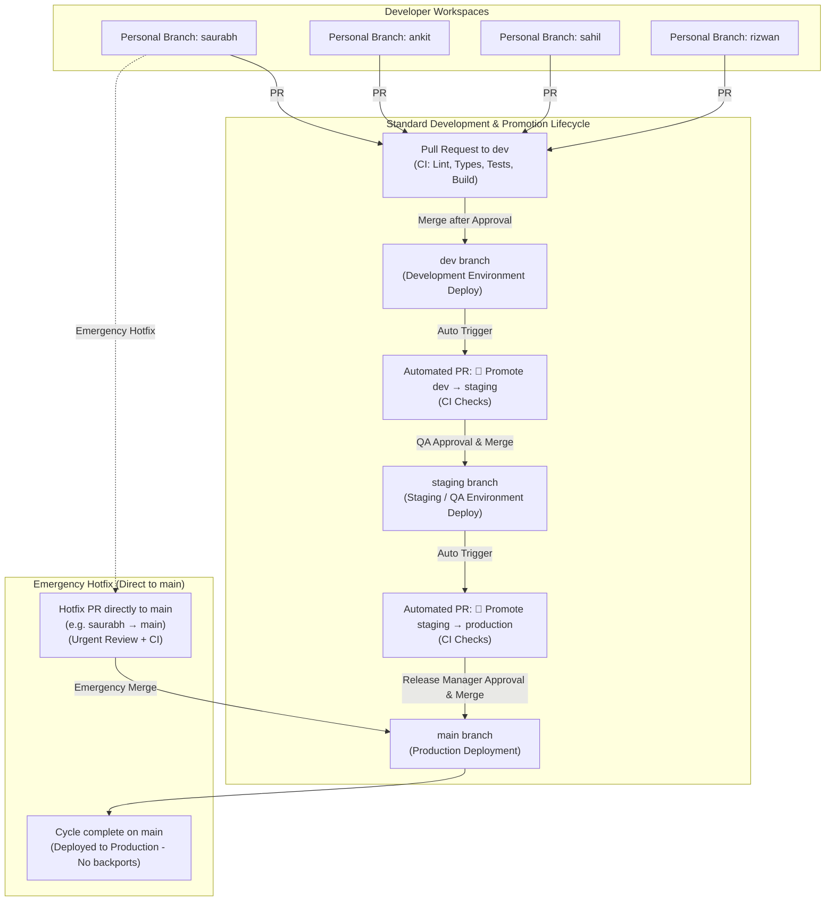

# Going Merry HMS — Git Workflow & Deployment Lifecycle Guide

## 1. Overview & Architecture

This repository follows an automated, promotion-based Git lifecycle that minimizes manual branch coordination while strictly enforcing automated testing (CI), peer review, and environment isolation.



---

## 2. Core Branch Definitions

| Branch            | Purpose                                                | Deployment Target                                                | Access & Protection                                                             |
| :---------------- | :----------------------------------------------------- | :--------------------------------------------------------------- | :------------------------------------------------------------------------------ |
| `main`            | Production release branch                              | Production (`https://hms.goingmerry.com` or Vercel Production)   | Strict Protection. No direct pushes. 1+ approvals required. Required CI checks. |
| `staging`         | Pre-production & QA verification                       | Staging (`https://staging-hms.goingmerry.com` or Vercel Staging) | Protected. No direct pushes. QA approval required. Required CI checks.          |
| `dev`             | Daily team integration branch                          | Development (`https://dev-hms.goingmerry.com` or Vercel Preview) | Protected. No direct pushes. Peer code review required. Required CI checks.     |
| Personal Branches | Active developer workspaces (`saurabh`, `ankit`, etc.) | Local / PR Preview                                               | Unprotected. Full developer autonomy. No `feature/*` branches.                  |

---

## 3. GitHub Actions Workflows

All workflows are located in `.github/workflows/`:

| Workflow File                                                                                        | Trigger                                             | Purpose                    | Key Actions                                                                                                                                                                   |
| :--------------------------------------------------------------------------------------------------- | :-------------------------------------------------- | :------------------------- | :---------------------------------------------------------------------------------------------------------------------------------------------------------------------------- |
| [`.github/workflows/ci.yml`](file:///.github/workflows/ci.yml)                                       | `push` & `pull_request` on `dev`, `staging`, `main` | Comprehensive Verification | Runs `npm ci`, `npx prisma generate`, `npm run lint`, `npx tsc --noEmit`, `npm test` (Vitest), and `npm run build` (Next.js).                                                |
| [`.github/workflows/promote-to-staging.yml`](file:///.github/workflows/promote-to-staging.yml)       | `push` on `dev` (upon PR merge)                     | Staging Promotion          | Compares `dev` with `staging`. Checks for existing open PRs (idempotency). Opens `🚀 Promote dev → staging` with commit logs & diff stats.                                     |
| [`.github/workflows/promote-to-production.yml`](file:///.github/workflows/promote-to-production.yml) | `push` on `staging` (upon PR merge)                 | Production Promotion       | Compares `staging` with `main`. Checks for existing open PRs. Opens `🚀 Promote staging → production` with release checklist and commit summaries.                            |

---

## 4. Required GitHub Branch Protection Settings

To configure branch protection in GitHub:
Navigate to **Repository Settings** &rarr; **Branches** &rarr; **Add branch ruleset** (or **Branch protection rule**).

### A. Protection for `main` (Production)

- **Branch name pattern:** `main`
- [x] **Require a pull request before merging**
  - Require approvals: **1**
  - [x] **Dismiss stale pull request approvals when new commits are pushed**
  - [x] **Require review from Code Owners** (optional)
- [x] **Require status checks to pass before merging**
  - [x] **Require branches to be up to date before merging**
  - Required status check: `Lint, Typecheck, Test & Build`
- [x] **Block force pushes**
- [x] **Block deletions**
- [x] **Do not allow bypassing the above settings**

### B. Protection for `staging` (Pre-Production / QA)

- **Branch name pattern:** `staging`
- [x] **Require a pull request before merging**
  - Require approvals: **1** (QA or Lead)
- [x] **Require status checks to pass before merging**
  - Required status check: `Lint, Typecheck, Test & Build`
- [x] **Block force pushes**
- [x] **Block deletions**

### C. Protection for `dev` (Development / Integration)

- **Branch name pattern:** `dev`
- [x] **Require a pull request before merging**
  - Require approvals: **1** (Peer review)
- [x] **Require status checks to pass before merging**
  - Required status check: `Lint, Typecheck, Test & Build`
- [x] **Block force pushes**
- [x] **Block deletions**

### D. Workflow Permissions Setting

To allow GitHub Actions to automatically open promotion PRs:

1. Go to **Settings** &rarr; **Actions** &rarr; **General**.
2. Scroll to **Workflow permissions**.
3. Select **Read and write permissions**.
4. Check the box **"Allow GitHub Actions to create and approve pull requests"**.
5. Save changes.

---

## 5. Environment Separation & Secret Management

### Strict Rule:

```text
Development Database ≠ Staging Database ≠ Production Database
```

**Never mix credentials or point staging/development to production databases or API keys.**

### Environment Matrix:

| Environment     | Branch    | Vercel Environment        | Supabase / Database    | Upstash Redis         | App URL                              |
| :-------------- | :-------- | :------------------------ | :--------------------- | :-------------------- | :----------------------------------- |
| **Development** | `dev`     | `Preview` (Branch: `dev`) | Supabase Dev DB        | Dev Redis cluster     | `https://dev-hms.goingmerry.com`     |
| **Staging**     | `staging` | `Preview` (Branch: `staging`) | Supabase Staging DB    | Staging Redis cluster | `https://staging-hms.goingmerry.com` |
| **Production**  | `main`    | `Production`              | Supabase Production DB | Prod Redis cluster    | `https://hms.goingmerry.com`         |

---

## 6. Step-by-Step Operating Procedures

### A. Developer Daily Workflow

Each developer works on their dedicated personal branch (`saurabh`, `ankit`, `sahil`, `rizwan`). Do NOT create `feature/*` branches.

```bash
# 1. Switch to your personal branch
git checkout saurabh

# 2. Pull the latest integration changes from dev
git fetch origin dev
git merge origin/dev

# 3. Work on your tasks, write tests, and verify locally
npm run lint
npx tsc --noEmit
npm test

# 4. Commit and push your changes
git add .
git commit -m "feat(module): describe task accomplishments"
git push origin saurabh

# 5. Open a Pull Request from your branch into dev:
gh pr create --base dev --head saurabh --title "feat(module): your task title"
```

Once the PR passes CI and is reviewed and approved, merge it into `dev`.

---

### B. Release to Staging (QA)

1. When any developer's PR merges into `dev`, GitHub Actions automatically detects the push.
2. The workflow [`.github/workflows/promote-to-staging.yml`](file:///.github/workflows/promote-to-staging.yml) runs:
   - Verifies changes exist.
   - Checks that no open promotion PR is already active.
   - Automatically opens a PR: `dev` &rarr; `staging` titled `🚀 Promote dev → staging`.
3. The QA team and engineers review the PR:
   - Verify CI passes.
   - Test on the Vercel preview deployment.
4. When QA signs off, **merge the PR into `staging`**.
5. Staging environment deploys automatically.

---

### C. Release to Production

1. When the promotion PR merges into `staging`, GitHub Actions detects the push.
2. The workflow [`.github/workflows/promote-to-production.yml`](file:///.github/workflows/promote-to-production.yml) runs:
   - Checks for existing open production PRs.
   - Automatically opens a PR: `staging` &rarr; `main` titled `🚀 Promote staging → production`.
3. The Release Manager / Lead reviews the checklist and commit log.
4. When approved, **merge the PR into `main`**.
5. Production environment deploys automatically to Vercel.

---

### D. Hotfix Procedure (Direct to `main`)

If an urgent production bug needs an immediate fix:

1. A developer creates a fix directly on their personal branch or hotfix branch.
2. Open a Pull Request directly targeting `main`:
   ```bash
   gh pr create --base main --head saurabh --title "hotfix: resolve critical production bug"
   ```
3. Once CI passes and emergency review is granted, merge the PR into `main`.
4. **Fulfillment**: Once merged into `main`, the hotfix lifecycle is complete. The fix is live in production, and no automated secondary or backport PRs are generated.
